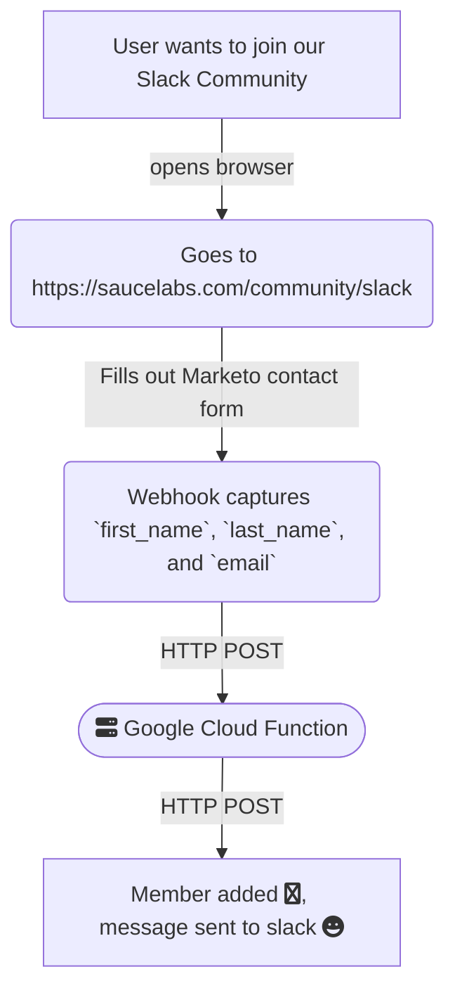

# Slack Auto-Invite Google Cloud Function

__Table of Contents__

1. [Overview](#overview)
2. [Requirements](#requirements)
3. [Usage](#usage)
4. [Testing](#testing)
5. [Deployment](#deployment)

## Overview
This is a Google Cloud Function that does the following:
* Parses an incoming HTTP POST request from a Marketo contact form Webhook,
* Extracts the `real_name` and `email` fields from the incoming request body,
* Automatically invites the user to a given Slack workspace using the [Slack Admin User Invite API](https://api.slack.com/methods/admin.users.invite) with the following parameters:
  * The workspace id: `SLACK_TEAM_ID`
  * The channels to add the user: `SLACK_CHANNEL_IDS`
* After a successful invitation, sends a chat message to a Slack channel defined by `SLACK_MESSAGE_CHANNEL`.

### Reference Architecture



## Requirements
* A GCP project with the Cloud Functions API enabled.
* A Slack Grid Enterprise account. 
* Slack Org/Grid privileges to create an app with the following **User Token Scopes**:
  * `admin.invites.read`
  * `admin.invites.write`
  * `admin.users.read`
  * `admin.users.write`,
  * `admin.users.invite`,
  * `chat.write`
  * `users.read`
  * `users.read.email`
  * `users.write`
* Node.js and npm installed on your local machine: `node v18*`

## Installation
1. Use `nvm` to set node to `18` i.e. `use nvm18`
2. Run `npm install`
3. Run `npm test`

## Testing

Unit Test are located in `./src/index.test.js`, and require the `jest` testing framework. There are two parts to manually test the functionality:

### Test that the Slack App is responding

Below is a Sample Slack API Post Request to the Slack API endpoint

```bash
curl -X POST \
-H "Authorization: Bearer $SLACK_USER_TOKEN" \
-H "Content-Type: application/json; charset=utf-8" \
-d '{
    "channel_ids": "$SLACK_CHANNEL_IDS",
    "email": "joe@example.com",
    "team_id": "$SLACK_TEAM_ID",
    "email_password_policy_enabled": true,
    "real_name": "Joe Shmo",
    "set_active": false
}' \
https://slack.com/api/admin.users.invite
```

### Test that the Google Cloud Function is able to send the request

Below is HTTP Post Request to the Google Cloud Function URL

```bash
curl -m 70 -X POST \
-H "Authorization: bearer $(gcloud auth print-identity-token)" \
-H "Content-Type: application/json" \
-d '{
    "real_name": "Joe Shmo",
    "email": "joe@example.com"
}' \
https://<gcp-region>-<project-id>.cloudfunctions.net/slack-auto-invite
```

## Deployment

> All GCP deployment resources are located in the `terraform` directory. 

The `.gitlab-ci.yml` config deploys to GCP and sets up a pipeline that includes several stages:
- `test`
- `build`
- `deploy`

The stages are defined with corresponding jobs, each specifying the container image to be used, scripts to run, rules to apply, and dependencies.

There are several key `variables` used in the pipeline, including:

- `GOOGLE_CREDENTIALS`: project service account key
- `GOOGLE_PROJECT_ID`: google project id
- `SLACK_USER_TOKEN`: Slack user token with correct API scopes
- `SLACK_MESSAGE_CHANNEL`: Channel to post notification messages for Slack admins
- `SLACK_CHANNEL_IDS`: Channels to add the new user 
- `SLACK_TEAM_ID`: The Slack Workspace ID

All of the variables above are crucial to the `src/` code and also to validate the terraform configuration.

### Deployment Stages
The `test` stage includes two jobs:

- `run-unit-tests`: runs unit tests using the Jest framework via `npm test`.
- `run-linter`: lints the code located in `src/` using `eslint`.

The `build` stage has a single job called `terraform_validate`, which validates the Terraform configuration.

The `deploy` stage has two jobs:

- `terraform_plan`: job that creates a deployment plan for Terraform.
- `terraform_apply`: job that deploys the changes.

The `terraform_apply` job also has a dependency on the `terraform_plan` job, and artifacts (the `tfplan` file) are saved for debugging purporses in case of job failure.
